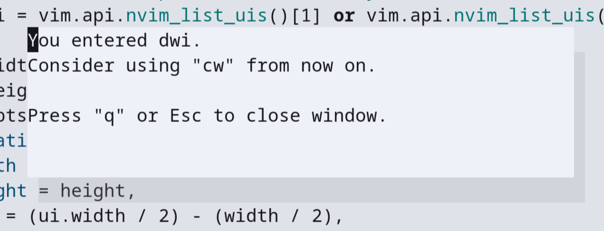

# vim-kaizen

`vim-kaizen` is a NeoVim plugin to encourage continuous improvement in your Vim keybindings.
It reminds you to use alternative and better keys for increased productivity and efficiency.

## Features

- Reminds you to unlearn inefficient commands.
- Provides suggestions for better commands.



## Installation

#### `vim-plug`

```vim
Plug 'mo42/vim-kaizen'
```
